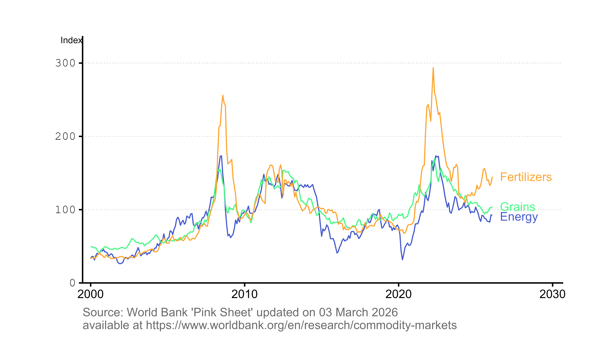

This site tracks a small set of World Bank Pink Sheet market indices that are refreshed by the repository's automated R pipeline and published as a Quarto website.

_Last updated: `r format(Sys.Date(), "%B %d, %Y")_

{fig-alt="Time-series plot of the Energy, Cereals, Oils and Meals, and Fertilizers Pink Sheet indices."}
