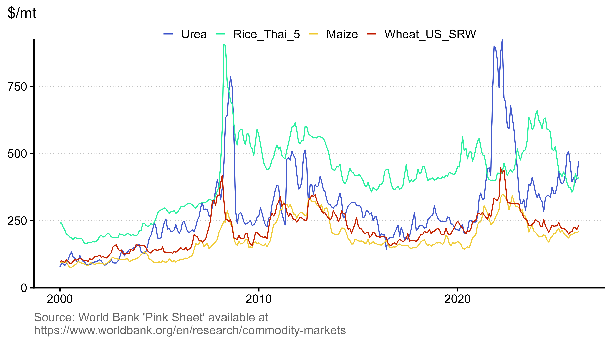

This site tracks selected commodity prices and price indices from the World Bank’s ‘Pink Sheet,’ which is typically updated at the beginning of each month. Prices are expressed in nominal US dollars, and indices are normalized to 2010 = 100.

{fig-alt="Time-series plot of the Energy, Grains, Oils and Meals, and Fertilizers indices."}

{fig-alt="Time-series plot of the Urea, Rice, Maize, and Wheat prices."}
